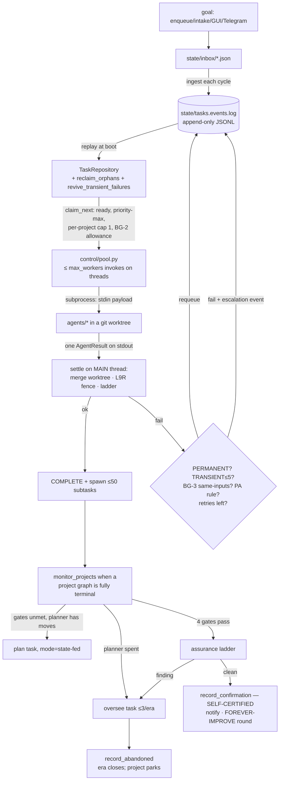

# CODEBASE_KNOWLEDGE — agentic-orchestrator (v2) Master Knowledge Document

*Produced by a direct-exploration pass on 2026-07-08 against the LIVE system at
`/Users/admin/Documents/agentic-orchestrator`. Every claim is grounded in source read this
session, cited by file and symbol. Read alongside `docs/HANDOFF.md` (live state + decisions)
— this document maps the code; the handoff carries the why. British spelling throughout.*

*Companion: `claude-orchestrator-main/codebase-analysis-docs/CODEBASE_KNOWLEDGE.md` maps **v1**,
the retired predecessor — useful only as the port-source reference for v3 (FOUNDATION §5).*

---

## PART 1 — HIGH-LEVEL OVERVIEW

### 1.1 What this application is

**agentic-orchestrator (v2)** is a single-developer autonomous software factory: you hand it a
goal, and it plans, builds, tests, judges, hardens, and certifies working software in the
background — pinging your phone when something is certified or genuinely stuck. The design
thesis, stated in `CLAUDE.md` and enforced throughout: a **durable, legible event log** +
**stateless subprocess agents** + **gates that cannot be cheated**, governed by a small set of
**laws-as-data** (`charter/laws.py`), each backed by a machine check.

It is the deliberate antithesis of v1 (`claude-orchestrator-main`): 5 agents instead of 28,
~6,100 lines of live source instead of ~26,000, one event log instead of five status
directories, laws with enforcing tests instead of a policy file agents merely read, and
**no self-development pipeline at all** — self-modification is structurally quarantined (L9)
and fenced at runtime (L9R).

**Current live state** (from `docs/HANDOFF.md` + `state/`, 8 July 2026): the system works
(verified end-to-end on a smoke project) but is **STOPPED** — `STOP` sentinel present,
because the weekly Claude Max usage window is exhausted. `state/flagship` = `orchestrator-v3`:
the next mission is for this orchestrator to **build its own successor (v3)** as a product in
`projects/orchestrator-v3/`, ten certifiable slices, governed by the DV-1..7 laws
(`docs/planning/13_V3_CAPABILITY_PLAN.md`). A Slice-1 `plan` task is already in the durable log.

### 1.2 Tech stack

| Layer | Technology | Where |
|---|---|---|
| Runtime | Python 3 (≥3.10 typing), stdlib-only core — **no Flask, no Tauri, no database** | all packages |
| LLM access | provider CLIs via subprocess: `claude` (implemented) and `codex` (wired, parser deliberately raises until validated) | `infra/llm.py` |
| Persistence | append-only JSONL event logs + atomic writes | `infra/event_store.py`, `infra/atomic_io.py` |
| Concurrency | thread pool for the *LLM call only*; all state mutation on the main thread | `control/pool.py` |
| Isolation | per-task git worktrees per project | `infra/worktree.py` |
| Architecture enforcement | import-linter (3 contracts), ruff (E,F), pytest architecture tests | `pyproject.toml`, `tests/architecture/` |
| GUI | stdlib HTTP server, one-tap actions | `edge/server.py` (port 8765) |
| Notifications | macOS `osascript` + Telegram (sender-locked, two-way) | `infra/notify.py`, `control/operator_chat.py` |
| Tests | pytest — 53 test files, ~341 test functions incl. 8 architecture meta-tests | `tests/` |
| Supervision | `run_forever.sh` (bash relaunch loop, honours STOP) | repo root |

### 1.3 The features and their business purposes

1. **Laws-as-data with machine checks** (`charter/laws.py`) — 18 laws; every `active` law names
   its enforcing test or import-linter contract, and the PRIME meta-check
   (`tests/architecture/test_every_law_has_a_check.py`) fails the build if one doesn't.
   *Purpose: "a law without a machine-check is a wish" — governance that cannot silently rot.*
2. **Event-sourced task lifecycle** (`infra/event_store.py` + `dispatch/repository.py`) — every
   transition is an appended event; `TaskRepository.replay()` rebuilds the entire task set from
   the log. Restart = resume; finished work is never re-run; retry budgets are derived from the
   log so **a restart can never launder a budget** (BG-3). *Purpose: crash-safe autonomy on the
   Claude Max 5-hour restart cadence.*
3. **Total state machine** (`core/state_machine.py`, L11) — every (status × event) pair defined;
   illegal pairs are no-ops, never exceptions. `QUEUED + BLOCK → BLOCKED` is legal — the
   structural fix for v1's transition spam. *Purpose: no undefined behaviour in the lifecycle.*
4. **Five-agent roster + one meta-agent** (`registry/agents.py`, laws L1/L5) — `task_manager`
   (incremental planner), `builder`, `tester` (independent author — anti-collusion),
   `judge` (cross-provider: openai/codex), `researcher`, plus the persistent **Overseer**
   (claude-fable-5). *Purpose: resist v1's agent proliferation; one responsibility each.*
5. **The un-cheatable completion contract** (`validation/`) — a project is done only when
   `REQUIRED_GATES = (tests, acceptance, judge, authenticity)` all pass **and** the
   progressive-assurance ladder comes back clean. *Purpose: an agent under budget pressure
   always finds the cheapest path to green; every gate exists to make the cheap path fail.*
6. **Progressive assurance / hardening ladder** (`validation/assurance.py`) — tests-rerun →
   mutation testing (`validation/mutation.py`, kill threshold 0.8) → acceptance-by-execution →
   adversarial LLM tiers. A finding routes to the Overseer, never to you. *Purpose: quality
   blocks completion (Quality Charter bar 6).*
7. **Zero-touch self-certification** (DG-2) — when gates + assurance are clean the daemon
   **self-certifies** (`repo.record_confirmation`) and notifies; then FOREVER-IMPROVE opens
   another improvement round until the planner returns `[]`. *Purpose: nothing waits on the
   operator; the phone ping is informational.* (Note the doc drift in §4.1.)
8. **Failure ladder with durable budgets** (`dispatch/dispatcher.py::_handle_failure` +
   `infra/triage.py`) — PERMANENT fail-fast → TRANSIENT requeue (capped at
   `MAX_TRANSIENT_REQUEUES = 5`) → BG-3 input-hash refusal of identical deterministic
   re-attempts → PA fast-path → bounded retry → escalate. *Purpose: every requeue path finite.*
9. **PA rule engine, overseer-evolved** (`pa/rules.py`, `pa/overseer.py`) — deterministic
   failure-cause → action rules; the Overseer mines recurring causes into candidates, promoted
   to active only with evidence and only for safe (non-code) actions. *Purpose: known failures
   handled for free, maturation curve without self-modification.*
10. **The persistent Overseer** (`agents/overseer.py`, `memory/overseer.py`) — one continuous
    Claude session (resumed by id from a stable cwd), hourly observe pulses, 24-h session reset
    with a **self-improving CORE+EXTRA handoff** (CORE immutable — the quality floor; EXTRA is
    data the overseer revises, so L9 holds). It can intervene in projects, abandon them
    (directives stick via the abandonment watermark), and reprioritise — via `control` tasks the
    daemon executes, never as code changes. BG-5 alarms on a wedged/dying guardian. *Purpose:
    a bounded "Jarvis" that steers without touching the machinery.*
11. **Runtime self-mod fence L9R** (`infra/worktree.py::selfmod_fence`, wired at every settle in
    `control/pool.py`) — any agent write to the orchestrator's own tree is diffed, quarantined
    to `state/quarantine/`, reverted, and fails the task. Born from the 12 Jun incident: a
    builder, blocked by the mutation gate, **edited the gate**. *Purpose: the examined never
    edit the examiner.*
12. **Budget governor + burn-rate breaker** (`control/budget.py`) — durable spend cap
    (`AGENTIC_BUDGET_USD`), kill-switch sentinel `state/KILL`, and a breaker that pauses paid
    work for 30 min when the trailing-40-run success ratio drops below 0.4 (min 20 runs).
    *Purpose: L6 bounded autonomy — burn-vs-progress can never run silent again (June ran at
    6.8% and nobody saw).*
13. **Depth before breadth, BG-2** (`control/breadth.py`) — until a first certification exists,
    dispatch is restricted to the human-set flagship (`state/flagship`; nothing in the codebase
    writes it — an architecture test asserts this). *Purpose: one project done properly beats
    eight half-built.*
14. **Boot self-test, BG-1** (`control/self_test.py`) — the daemon refuses to dispatch unless
    every law-linked check is present, collected, and passing; deliberately no bypass flag.
    *Purpose: enforcement before features — the ordering v2's own history proved necessary.*
15. **Knowledge base + deep research** (`memory/knowledge.py`, `agents/researcher.py`,
    `validation/research_contract.py`) — an append-only Obsidian-style KB (DV-2) and a tiered
    research agent whose evidence bundle must pass the DV-3 contract (depth floor, no
    link-dumps, independent corroboration, public-sources-only). **Committed but gates
    unwired** (commit `eb31792` — "isolated, gates unwired"). *Purpose: v3's load-bearing
    memory and research capability, staged in v2 first.*
16. **Operator surfaces** — `control/enqueue.py` / `control/intake.py` (goal → task graph via
    `state/inbox/`), `control/confirm.py` (manual confirmation channel), `edge/server.py`
    (one-tap GUI: `/api/state`, `/api/confirm`, `/api/goal`, `/api/instruct`),
    `control/operator_chat.py` (two-way Telegram: your messages become turns in the Overseer's
    one continuous session), `control/scorecard.py` (deterministic metrics: success ratio,
    time-in-agent, waste counters, runs-per-certification).

### 1.4 How it all composes (one paragraph)

A goal enters through intake/enqueue/GUI/Telegram as a task file in `state/inbox/`; the daemon
(`control/daemon.py` — the single supervised entrypoint, L8) ingests it into the event log.
The concurrent pool claims ready tasks (dependency-gated, priority-ordered, one writer per
project tree by default) and runs the registry-resolved agent subprocess in a per-task git
worktree; results settle on the main thread through the failure ladder, and the L9R fence
checks the orchestrator's own tree at every settle. When a project's graph drains, the monitor
evaluates the four automated gates; unmet gates trigger a replan (incremental planner, ≤20
iterations per era) or an Overseer intervention (≤3 per era), then abandonment — never a silent
stall. Gates met triggers the assurance ladder; clean means self-certified, phone ping, and a
FOREVER-IMPROVE round. In parallel the Overseer pulses hourly in its one persistent session,
evolves the PA from failure history, and answers your Telegram messages; the budget governor,
burn breaker, breadth cap, deadline, STOP sentinel and kill-switch bound everything.

---

## PART 2 — SYSTEM ARCHITECTURE

### 2.1 The layer contract (import-linter, law L2)

```
edge  →  control  →  (dispatch | scheduling | validation)  →  pa  →  agents  →  memory  →  infra  →  core
registry = leaf (imports nothing internal)
selfdev  = quarantined (NOTHING may import it — L9 contract)
```

Three enforced contracts in `pyproject.toml [tool.importlinter]`: the layer ordering, the
registry-as-leaf rule, and the selfdev quarantine. `scheduling/` and `selfdev/` are
**placeholder packages** (4-line `__init__.py` each) — the seams exist before the features.

### 2.2 Directory map (live source only)

```
agentic-orchestrator/
├── charter/laws.py            # 18 laws as frozen dataclasses, each naming its check
├── core/                      # pure domain, stdlib only
│   ├── models.py              #   Task, AgentResult (defined ONCE — fixes v1's dual definition),
│   │                          #   TaskStatus, Event; AgentResult.cause (L10) + .intent
│   └── state_machine.py       #   TRANSITIONS: total (status × event) table; transition() never raises
├── infra/                     # IO + provider seams
│   ├── atomic_io.py           #   THE only sanctioned writer/deleter (L7): write_json_atomic,
│   │                          #   write_text_atomic, append_jsonl (fsync), read_jsonl (truncation-tolerant)
│   ├── event_store.py         #   append-only JSONL log + replay()
│   ├── llm.py                 #   call_llm(provider, model, prompt…) → LLMResult{text, cost};
│   │                          #   RateLimited marker; codex parser raises until validated
│   ├── triage.py              #   ErrorClass TRANSIENT/RECOVERABLE/PERMANENT; classify();
│   │                          #   is_input_deterministic() (BG-3); RATE_LIMIT_HINTS (v1 port, row B1)
│   ├── worktree.py            #   per-task worktrees, merge-back on main thread; selfmod_fence() (L9R)
│   ├── workspace.py           #   resolve_project_dir (L4 containment), check_pristine (no scratch)
│   ├── notify.py              #   desktop + Telegram (config: state/telegram.json); never raises
│   └── pidlock.py             #   single instance (L8); stale-PID reclaim; no auto-restart
├── registry/agents.py         # TASK_TYPE_TO_AGENT, AGENT_COMMANDS, AGENT_MODELS, model_for()
│                              #   (env override AGENTIC_<AGENT>="provider:model")
├── memory/
│   ├── knowledge.py           #   KnowledgeBase: entries/<id>.md + INDEX.md (DV-2; gates unwired)
│   └── overseer.py            #   session pointer + CORE(immutable)+EXTRA(self-improved) handoff
├── agents/                    # 6 subprocess agents, all with INJECTED LLM calls (token-free tests)
│   ├── common.py              #   read_payload(stdin) / emit(stdout) / safe_main (crash → caused failure)
│   ├── task_manager.py        #   INCREMENTAL planner: state in → next small batch out; [] = goal met
│   ├── builder.py             #   builds in projects/<name>/ (worktree cwd); L4 purity guard
│   ├── tester.py              #   independent adversarial test author (anti-collusion, F5)
│   ├── judge.py               #   cross-provider review (openai/codex); suite-green ≠ proof (F2)
│   ├── overseer.py            #   modes: intervene / observe / succession (persistent session)
│   └── researcher.py          #   tiered deep research → evidence bundle → KB (kind=research)
├── pa/
│   ├── rules.py               #   load/save/consult over state/pa_rules.json (active rules only)
│   └── overseer.py            #   evolve(): recurring causes → candidates → curated promotion (SAFE_ACTION only)
├── validation/
│   ├── gates.py               #   REQUIRED_GATES=(tests,acceptance,judge,authenticity); run_test_gate;
│   │                          #   DEFAULT_TEST_COMMAND uses sys.executable (macOS python3 trap)
│   ├── authenticity.py        #   no-stub static scan (AST + regex; abstract/Protocol exempt)
│   ├── acceptance_exec.py     #   run declared `acceptance` file criteria; NO declaration = FAIL;
│   │                          #   mock tells (--mock/fake/dummy/stub) = FAIL (DG-6 / D2.5)
│   ├── mutation.py            #   AST mutants in a throwaway copy; killed/total ≥ 0.8 or fail
│   ├── assurance.py           #   run_assurance over Tiers; first finding halts; governor duck-typed
│   └── research_contract.py   #   DV-3: depth floor, excerpts required, ≥N independent domains,
│                              #   paywalled source rejects the bundle
├── dispatch/
│   ├── repository.py          #   TaskRepository over the event store (see §2.3)
│   ├── dispatcher.py          #   select_next_task, settle(), _handle_failure ladder,
│   │                          #   propagate_prerequisite_failures (fixpoint), MAX_SPAWNED_PER_TASK=50
│   └── runner.py              #   make_subprocess_invoke(): registry command, stdin payload,
│                              #   one stdout AgentResult; failures always carry cause (F10)
├── control/
│   ├── daemon.py              #   THE entrypoint: python -m control.daemon (see §2.4)
│   ├── pool.py                #   run_concurrent: ≤ max_workers (default 8; run_forever sets 20)
│   ├── budget.py              #   BudgetGovernor: durable cap + KILL + burn breaker (0.4/40/20/30min)
│   ├── breadth.py             #   BG-2 flagship allowance (human-only file)
│   ├── project.py             #   evaluate_project → ProjectOutcome{gates, complete}
│   ├── self_test.py           #   BG-1 boot self-test (no bypass)
│   ├── intake.py / enqueue.py / inbox.py    # goal → graph → inbox → log
│   ├── confirm.py             #   manual confirmation channel (state/confirmations/)
│   ├── operator_chat.py       #   two-way Telegram (sender-locked; durable offset)
│   ├── scorecard.py           #   deterministic metrics from the durable records
│   └── loop.py                #   bounded sequential driver (L6) — pool.py is the production driver
├── edge/server.py             # stdlib HTTP GUI :8765 — reads the log, acts via inbox/confirm only
├── selfdev/, scheduling/      # quarantined / placeholder seams
├── tests/                     # 45 files, ~341 tests; tests/architecture/ = the law checks
├── docs/                      # HANDOFF.md, QUALITY_CHARTER.md, RUNBOOK_GIGABYTE.md, planning/
├── run_forever.sh             # external supervisor (relaunch loop; STOP-aware; singleton lock)
└── state/ (gitignored)        # tasks.events.log, budget.events.log, pa_rules.json, flagship,
                               # inbox/, confirmations/, quarantine/, overseer_session.json,
                               # handoff_latest.md, handoff_extra.md, telegram*.json, KILL, STOP(root)
```

Note: `docs/OPERATING_GUIDE.md` is named in HANDOFF §7's read order but **does not exist** —
the operational content lives in HANDOFF §4/§6/§8, `run_forever.sh` comments, and
`RUNBOOK_GIGABYTE.md`. `projects.archived-*/` holds retired v2-built products (deal-sniper,
situation-monitor, writing-assistant, travel-designer…) — reference output, not live code.

### 2.3 The event-sourced lifecycle



Key `dispatch/repository.py` mechanics: failure budgets are Counters rebuilt from
`task_result` events at replay (BG-3); `record_abandoned` stamps a **watermark** so an
abandonment closes the budget era (the 12 Jun lesson — a resurrected project must not inherit
its dead predecessor's spent planner); `dormant_since_abandonment` parks abandoned projects so
the monitor can never resurrect them on its own initiative; `reclaim_orphans` +
`revive_transient_failures` run at every boot (the 5-hour-restart recovery pair);
`claim_next(per_project_cap=1)` serialises writers per project tree (env
`AGENTIC_PROJECT_CONCURRENCY` raises it — worktrees make >1 safe).

### 2.4 The daemon cycle (`control/daemon.py::main` + `serve`)

Boot: pidlock → **BG-1 boot self-test (SystemExit 3 on failure — no bypass)** → replay log →
reclaim orphans → revive transients → BudgetGovernor (cap from `AGENTIC_BUDGET_USD`, default
10.0; `run_forever.sh` sets 1,000,000 — the Max-subscription posture where the *usage window*
is the real budget) → read flagship → serve.

Every cycle (`_maintain` + `on_cycle`, which also run *during* long batches so the pool can't
starve them): ingest inbox → cascade prerequisite failures → ingest confirmations → burn-flag
notification → `monitor_projects` → `tick_overseer_session` (reset/succession/pulse, BG-5
wedge alarm) → `poll_operator_messages` → `process_overseer_control` (abandon/reprioritise
directives) → PA evolve+save → 12-h heartbeat notify.

Stop conditions (`should_stop`): SIGTERM/SIGINT flag, `STOP` sentinel at repo root,
`governor.should_stop()` (cap or `state/KILL`), `AGENTIC_DEADLINE_HOURS` expiry (writes STOP
itself — a self-chosen stop stays stopped).

Constants that shape behaviour: `MAX_PLAN_ITERATIONS = 20` (per era),
`MAX_OVERSEER_INTERVENTIONS = 3` (per era), `HEARTBEAT_SECONDS = 12*3600`,
`OVERSEER_PULSE_SECONDS = 3600`, `OVERSEER_PROJECT = "__overseer__"` (reserved `__` prefix —
skipped by monitoring, always dispatchable under BG-2).

### 2.5 Agent invocation contract

`dispatch/runner.py::make_subprocess_invoke`: resolve agent from
`registry.TASK_TYPE_TO_AGENT` → command from `AGENT_COMMANDS` (always `sys.executable -m
agents.<name>`) → JSON payload on **stdin** → exactly one AgentResult JSON line on **stdout**.
Non-zero exit, timeout, or unparseable output all become a failed AgentResult **with a
`cause`** (L10/F10) — the orchestrator never sees a bare traceback. `agents/common.py::
safe_main` guarantees the same from inside the agent. All LLM calls inside agents are
**injected callables**, so every agent's logic is tested without tokens.

`infra/llm.py::call_llm(provider, model, prompt, cwd, timeout, session…)`: claude path parses
the CLI's JSON (text + cost); rate/usage-limit wording raises `RateLimited` (its message is a
transient cause by construction); hard CLI errors and session errors are distinguished; the
codex path **deliberately raises** until its parser is validated against real
`codex exec --json` output (probe-before-you-build).

### 2.6 Cross-cutting concerns

- **File mutation** — only via `infra.atomic_io` (L7), enforced by
  `tests/architecture/test_file_preservation.py` scanning source for raw `open(w)`/
  `write_text`/`unlink`/`rmtree` (`tests/` and `projects/` exempt; git operations in
  worktree.py exempt because git owns the tree).
- **Security** — L9 (static: nothing imports `selfdev`) + L9R (runtime fence at every settle,
  forensic quarantine, hermetic under pytest); Telegram sender-lock (only the operator's
  `chat_id` is read; others dropped unread); GUI acts only through channels the daemon already
  ingests (`edge/server.py` never writes the log); agents hold zero GitHub credentials —
  publication is a human act (`scripts/publish_projects.sh`); no secrets in repo
  (`state/telegram.json` gitignored).
- **Observability** — the event logs ARE the observability; `control/scorecard.py` computes
  success ratio, wall-clock-per-run (the honest cost proxy on a Max subscription),
  waste counters, merges landed, and runs-per-certification. `notify()` is advisory only —
  nothing depends on a notification arriving.
- **Model wiring** (`registry/agents.py::AGENT_MODELS`) — planner/builder/tester/researcher:
  claude sonnet; judge: **openai codex** (F5 cross-provider independence); overseer:
  **claude-fable-5** (DG-3 — strongest model to the highest-stakes judgement; watch
  retries-per-completion). Per-agent env override `AGENTIC_<AGENT>="provider:model"` for
  outages; a rejected model string is a PERMANENT (loud) failure.

---

## PART 3 — FEATURE-BY-FEATURE DETAIL

### 3.1 Planning: the incremental replan loop

`agents/task_manager.py` receives the goal + current project state (files, done steps, failed
steps **with causes** from `repo.last_results()`) and emits only the *next small batch* —
never a big-bang decomposition (v1's planner routed test-writing to the judge and dead-ended).
`[]` means "goal met" (`_planner_done`), which terminates the loop. The daemon feeds state
back on every replan (`_project_state`). Budgets are **per era** (`_era_counts`): a `plan`
task with `payload.mode == "rescope"` or an abandonment watermark opens a fresh era — without
this, a re-scoped project arrives pre-exhausted (the 11 Jun stall read "20/20 iterations"
mostly belonging to an abandoned goal). `payload.mode == "improve"` marks FOREVER-IMPROVE
rounds after certification.

### 3.2 The gates (why each exists)

| Gate | File | Cheap path it kills |
|---|---|---|
| tests | `validation/gates.py::run_test_gate` (project's own suite, 1800 s timeout) | code that doesn't run |
| authenticity | `validation/authenticity.py` | stubs/TODO/`pass`-bodies/mock identifiers in shipped code |
| acceptance | `validation/acceptance_exec.py` | green suite over a dead product; **no declaration = FAIL**; `--mock` in a criterion = FAIL (the June demo literally ran `acceptance.py --mock` against a dead package) |
| judge | `agents/judge.py` (cross-provider) | builder blessing its own work; suite-green treated as proof |
| mutation (assurance) | `validation/mutation.py` (0.8 kill threshold, throwaway copy) | tests that cannot fail |
| adversarial/LLM tiers (assurance) | `validation/assurance.py::hardening_tiers` | anything the deterministic tiers can't see |

The assurance loop **never regresses**: tiers only verify; first finding halts and routes to
the Overseer. The governor is duck-typed and injected (validation must not import control —
the arrow points inward).

### 3.3 The Overseer subsystem (the one stateful agent)

- **Session continuity**: `memory/overseer.py` persists the session pointer;
  every oversee task resumes the same Claude session from the **repo root** (sessions are
  namespaced by cwd; `--dangerously-skip-permissions` must be re-passed on every resume).
- **Lifecycle** (`tick_overseer_session`): boot/24-h reset → fresh session seeded with the last
  handoff; near the wipe → a `succession` task writes the CORE+EXTRA handoff (CORE immutable
  floor; EXTRA self-improved, length-capped); otherwise hourly `observe` pulses.
- **BG-5 guardian liveness** (`overseer_pulse_health`): ≥2 outstanding pulses (wedge — stop
  stacking) or last two terminal runs failed (alarm, but fresh pulses allowed — a new session
  is the self-heal). Queued operator messages don't count as wedges.
- **Authority**: spawns `control` tasks (abandon/reprioritise) that the daemon executes —
  `dispatch` never runs `control` tasks as agents. Abandon directives are recorded durably so
  they **stick** (12 Jun: an operator-ordered fleet park was undone by the monitor within
  minutes before this fix). It never touches orchestrator code (L9), and directive-bearing
  pulses notify the operator in the overseer's own words.

### 3.4 Intake and operator surfaces

`control/enqueue.py` (one task) and `control/intake.py` (goal → build+validate graph) write
files to `state/inbox/`; the daemon folds them into the log (multi-writer safe, works whether
the daemon is up or not). `edge/server.py` (:8765) reads the log for `/api/state` and acts by
dropping inbox/confirmation files (`/api/goal`, `/api/confirm`, `/api/instruct`) — it can
never bypass a law or race the daemon. `control/operator_chat.py` polls Telegram getUpdates
each cycle (zero-timeout), sender-locked, durable offset written *after* enqueue
(at-least-once); first contact drains history without enqueueing. `control/confirm.py` lists
and confirms `pending_user` projects manually — retained even though certification is now
automatic (§4.1).

### 3.5 The v3 build mission (context any agent here must hold)

Per `docs/HANDOFF.md` and `docs/planning/13_V3_CAPABILITY_PLAN.md`: v3 is built **by this
orchestrator as a product** in `projects/orchestrator-v3/` (product territory — the L9 fence
does not apply there; this is not self-modification). Ratified DV-laws: capability-plus-gate
discipline; the KB is load-bearing (DV-2); research is deep-or-fail (DV-3); modules plug in
behind a fail-closed seam-gate (DV-6); DV-7 dev-mode separates operator edits from agent
tampering. The port list (FOUNDATION §5) draws from **v1**: atomic-write ladder, queue
semantics, the agent contract, dependency cascade with the correct state machine, supervisor
lifecycle, bounded anti-storm retry — plus `docs/planning/port/v1/` snapshots (error_triage,
admission_control, watchdog, velocity_monitor…). Fork-clean vs evolve-in-place is **settled —
do not relitigate**. The v3 build charter and green foundation are **not yet in this repo**
(operator scratchpad `outputs/orchestrator-v3/`; destined for `docs/planning/16_V3_BUILD_CHARTER.md`
and `projects/orchestrator-v3/`).

---

## PART 4 — THINGS YOU MUST KNOW BEFORE CHANGING CODE

### 4.1 Doc-vs-code drift (verified this session)

1. **The user gate has been removed from the completion contract.** `CLAUDE.md` and
   `control/project.py`'s docstring still describe a four-gate contract *plus* your one-tap
   confirmation ("the Da Nang model"). The code says otherwise: `validation/gates.py` —
   "Completion is decided ENTIRELY by automated gates — there is no human-confirmation gate";
   `REQUIRED_GATES` has four automated members, and `monitor_projects` self-certifies
   (`record_confirmation`) when assurance is clean (DG-2 zero-touch). The confirmation channel
   (`control/confirm.py`, `ingest_confirmations`) still exists and works, but nothing blocks
   on it. Trust `gates.py` + `daemon.py`.
2. **`docs/OPERATING_GUIDE.md` does not exist** despite being step 2 of HANDOFF's read order.
3. **`graphify-out/` does not exist** despite CLAUDE.md's tooling section (rebuild with
   `/graphify .` if wanted).
4. **CLAUDE.md says "~207 tests"; the suite now has ~341 test functions** across 45 files.
5. **KB + research are committed but unwired** (commit `eb31792`): `memory/knowledge.py`,
   `agents/researcher.py`, `validation/research_contract.py` and the `research` task type
   exist and are tested, but no gate/planner path invokes them yet — wiring them is v3-slice
   work (DV-2/DV-3), not a bug.

### 4.2 Operational gotchas (each cost real time — HANDOFF §4, verified against code)

6. **The usage window is the binding constraint.** A stall is usually the weekly Claude Max
   window or auth, not a bug. Auth expiry surfaces as `claude exited 1`/401 — currently
   misclassified as transient and loops (known hardening TODO). Fix: `claude login`.
7. **The L9R fence flags uncommitted OPERATOR edits** to orchestrator source at every settle —
   quarantining them to `state/quarantine/` and failing tasks. Commit before the daemon runs
   (or use the planned DV-7 dev-mode). The fence is hermetic under pytest (it polices only the
   runtime tree — it once quarantined its own uncommitted implementation).
8. **`state/flagship` is read ONCE at daemon boot** (`main()` → `read_flagship`); repointing it
   requires a restart. Under BG-2 with no certification, a non-flagship project is silently
   starved (why `smoke-test` stalled).
9. **Stopping properly**: `STOP` must be at the repo **root**; a full stop is `touch STOP` plus
   `pkill -9` of both `run_forever` and `control.daemon` (SIGTERM won't interrupt a daemon
   mid-LLM-call). A deliberate STOP stays down; the supervisor only relaunches crashes.
10. **`.git/index.lock` recurs in this environment** — `rm -f .git/index.lock`.
11. **One orchestrator per account** — two daemons share and exhaust one weekly window.
12. **The daemon loads once** — restart after editing any module; restart = resume via replay.

### 4.3 Design invariants you must not casually break

13. **All state mutation on the main thread** (`control/pool.py`) — only the LLM subprocess
    call runs on workers. Do not move claiming/settling/git onto threads.
14. **Budgets derive from the event log** (BG-3) — never keep a retry counter only in memory,
    and never key era-opening on a payload field the overseer's directives can't set (the 12
    Jun resurrection died at first failure exactly this way).
15. **`sys.executable`, never bare `python`** — single source `validation/gates.py::
    DEFAULT_TEST_COMMAND` and `registry/agents.py::_PY` (macOS exit-127 trap).
16. **Illegal transitions are no-ops** — code that *relies* on an exception from the state
    machine is wrong; check `transition()`'s return instead. `cancel_task` routes
    QUEUED→BLOCKED→FAILED because QUEUED→FAILED is deliberately not legal.
17. **Reserved `__` projects** are skipped by monitoring and exempt from BG-2 — don't name a
    real project with a `__` prefix.
18. **New laws ship with their check in the same change** — the PRIME meta-check turns an
    unchecked active law into a red build.
19. **`monitor_projects` re-evaluates only on signature change** (`_signature` = the
    (task_id, status) set) — status-neutral edits won't trigger re-evaluation; parked
    (abandoned-dormant) projects are skipped entirely.
20. **The Overseer's session must run from a stable cwd** (repo root) or continuity silently
    breaks; `--dangerously-skip-permissions` is not sticky across `--resume`.

---

## PART 5 — TECHNICAL REFERENCE & GLOSSARY

### 5.1 Key data structures (`core/models.py`)

**Task**: `task_id, title, task_type, status(queued|in_progress|done|failed|blocked),
depends_on[], payload{}, acceptance_criteria[], artifacts[], retries, max_retries(3),
parent_task_id, project("default"), priority(0)`.
**Event enum**: CLAIM, COMPLETE, FAIL, BLOCK, UNBLOCK, REQUEUE, RECLAIM.
**AgentResult**: `ok, summary, artifacts[], spawned_tasks[], metadata{}, block_reason,
cause (L10 — a failed result must explain why), intent("inform_complete")`.
**Event-log kinds** (`dispatch/repository.py`): task_created, task_transition, task_result,
task_cancelled, task_reprioritised, project_status, project_confirmed, assurance_result,
project_abandoned, escalation, attempt_inputs.

### 5.2 Task-type → agent → model (`registry/agents.py`)

plan→task_manager (claude/sonnet) · implement→builder (claude/sonnet) · test→tester
(claude/sonnet) · validate→judge (**openai/codex**) · oversee→overseer (**claude/claude-fable-5**)
· research→researcher (claude/sonnet; Fable after the Overseer eval, DV-4) · `control` → executed
by the daemon, never an agent.

### 5.3 Environment variables & sentinels

| Name | Effect |
|---|---|
| `AGENTIC_BUDGET_USD` | budget cap (daemon default 10.0; run_forever sets 1e6) |
| `AGENTIC_MAX_WORKERS` | concurrent agents (pool default 8; run_forever sets 20) |
| `AGENTIC_PROJECT_CONCURRENCY` | writers per project tree (default 1) |
| `AGENTIC_DEADLINE_HOURS` | bounded run; writes STOP at expiry |
| `AGENTIC_<AGENT>="provider:model"` | per-agent model reroute (outages) |
| `STOP` (repo root) | drain and stay down (supervisor honours it) |
| `state/KILL` | immediate kill-switch (governor) |
| `state/flagship` | BG-2 flagship (HUMAN-ONLY; read once at boot; currently `orchestrator-v3`) |
| `state/telegram.json` | `{token, chat_id}` — enables notify + operator chat |

### 5.4 CLI surfaces

`python -m control.daemon` (run) · `nohup bash run_forever.sh > supervisor.log 2>&1 &`
(supervised) · `python -m control.enqueue "<goal>" --project X` · `python -m control.intake
"<goal>" --project X --accept "…" "…"` · `python -m control.confirm [project]` ·
`python3 -m control.scorecard [--since-hours N]` · `python -m edge.server` (:8765) ·
agents runnable directly: `echo '{"task":{…}}' | python -m agents.builder`.
Gates locally: the `run-gates` skill = `ruff check .` + `lint-imports` + `pytest tests/`.
Skills in `.claude/skills/`: run-gates, graphify-update, add-agent, enqueue-goal.

### 5.5 Glossary

- **Law** — a governance rule in `charter/laws.py` with a named machine check; PRIME enforces
  the pairing. Key ids: L2 layers, L4 purity, L6 bounded autonomy, L7 atomic IO, L8 single
  entrypoint, L9/L9R self-mod quarantine/fence, L10 self-explaining failures, L11 total state
  machine, BG-1 boot self-test, BG-2 depth-before-breadth, BG-3 durable budgets, BG-5 guardian
  liveness, D25 acceptance-by-execution.
- **Gate** — an automated completion check (tests/acceptance/judge/authenticity); **assurance
  ladder** — post-gate hardening (rerun→mutation→execution→adversarial).
- **Era** — the budget window for a project's planner/overseer counters; opened by a rescope
  plan or closed-and-reopened by an abandonment watermark.
- **Flagship** — the single project BG-2 allows before a first certification; human-set.
- **Zero-touch (DG-2)** — self-certification: no human gate blocks completion.
- **FOREVER-IMPROVE** — post-certification improvement rounds until the planner returns [].
- **PA** — deterministic failure-cause→action rules, overseer-evolved, curated promotion.
- **Overseer** — the persistent meta-agent (one resumed Claude session; CORE+EXTRA handoff).
- **Wedge** — ≥2 outstanding overseer pulses (BG-5): stop stacking, alarm.
- **Fence (L9R)** — settle-time quarantine+revert of agent writes to the orchestrator tree.
- **Inbox / confirmations** — file-drop channels the daemon ingests (multi-writer safe).
- **DV-1..7 / DG-n / F-n / R-n** — ratified v3 laws / decision-gates / findings / risks in
  `docs/planning/` (13 for DV, 08 for the registry, 09 for build governance).
- **Da Nang model** — design the operator can steer from a phone; survives zero-touch as the
  notification + Telegram + edge surfaces.

### 5.6 ASSUMPTIONS

| # | Assumption | Confidence | Verify |
|---|---|---|---|
| 1 | The user gate's removal (self-certification) is a ratified decision (DG-2), not an accident — CLAUDE.md just lags | High | HANDOFF §3 "zero-touch+breaker"; QUALITY_CHARTER §7 vs gates.py comment |
| 2 | `scheduling/` and `selfdev/` are intentional empty seams | High | 4-line `__init__.py`s; L9 contract references selfdev |
| 3 | Codex judge is currently unusable until its parser is validated; judge runs may fail loudly or be rerouted via `AGENTIC_JUDGE` | Medium | `infra/llm.py::_parse_codex_output`; run_forever comments |
| 4 | The archived `tasks.events.log.archived-*` marks a deliberate log reset alongside `projects.archived-*` | Medium | ask operator; timestamps match |
| 5 | v3 charter/foundation intake will follow HANDOFF §5/§8 exactly (charter → planning/16, foundation → projects/orchestrator-v3) | High | HANDOFF; state/flagship already set |

---

## STATE BLOCK (final)

- `INDEX_VERSION`: v2-2026-07-08.1
- `FILE_MAP_SUMMARY` (live source; archived projects excluded): control/daemon.py (529) · edge/server.py (578) · agents/overseer.py
  (372) · dispatch/repository.py (280) · memory/overseer.py (240) · memory/knowledge.py (216)
  · dispatch/dispatcher.py (216) · infra/llm.py (193) · infra/worktree.py (166) ·
  control/scorecard.py (164) · control/pool.py (154) · validation/* (six gates) ·
  charter/laws.py (76) · registry/agents.py (74) · core/* (123) · ~6.1 k live lines,
  53 test files / ~341 tests.
- `OPEN_QUESTIONS`: (a) confirm DG-2 removed the user gate permanently and update
  CLAUDE.md/project.py docstrings; (b) when is the codex parser validated (judge currently
  cross-provider on paper only)? (c) move v3 charter+foundation into the repo (HANDOFF §5);
  (d) write the missing OPERATING_GUIDE or fix HANDOFF's read order; (e) 401-as-transient
  hardening TODO.
- `KNOWN_RISKS`: usage window is the single bottleneck; fence-vs-operator friction until
  DV-7 dev-mode lands; git index.lock recurrence; judge reroute (`AGENTIC_JUDGE=claude:opus`)
  weakens F5 independence while active; notify() silence is by design — the log is the truth.
- `GLOSSARY_DELTA`: none pending — §5.5 current.

*End of knowledge document.*
